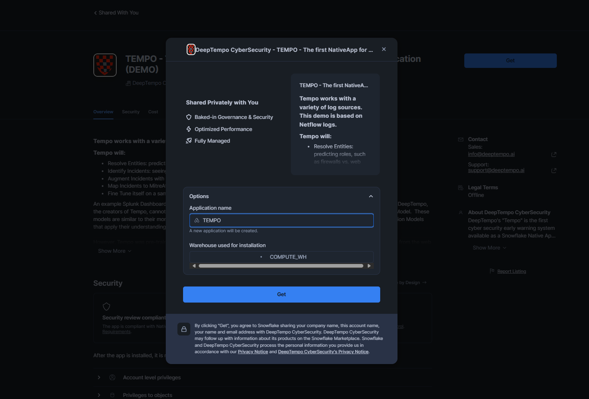

author: mando222
id: tempo
summary: This is a guide on getting started with tempo on Snowflake
categories: Getting-Started
environments: web
status: Published 
feedback link: https://github.com/Snowflake-Labs/sfguides/issues
tags: Getting Started, Security, LLGM, Intrusion Detection

# Getting Started with TEMPO (Using Sample Data)
<!-- ------------------------ -->
## Overview 
Duration: 1

This guide will walk you through setting up and using the TEMPO Native App in your Snowflake environment with the provided sample data.

### What You’ll Learn 
- How to run Tempo on sample data
- How to view the output in Splunk

### What You’ll Need 
- A [Snowflake](https://www.snowflake.com/login/) Account 
- A [Splunk](https://www.splunk.com/) Account or instance

### What You’ll Build 
- A working LogLM alerting dashboard

<!-- ------------------------ -->
## Install the TEMPO Native App
Duration: 2

1. Obtain the TEMPO native app from the Snowflake Marketplace.
2. Change the app's default name to `TEMPO`.


3. Once installed, the app will be available in your Snowflake environment.
4. Grant the app privileges to create the required compute resources:

```sql
GRANT CREATE COMPUTE POOL ON ACCOUNT TO APPLICATION TEMPO;
GRANT CREATE WAREHOUSE ON ACCOUNT TO APPLICATION TEMPO;
```

The application comes with its own warehouse (TEMPO_WH) and compute pool (TEMPO_COMPUTE_POOL) with the following specs, which will be used for container services runs.

### TEMPO_WH
- **Type**: Snowpark Optimized
- **Size**: Medium
- **Auto Suspend**: 120 seconds
- **Auto Resume**: Enabled
- **Initial State**: Active

### TEMPO_COMPUTE_POOL
- **Node Configuration**:
  - **Minimum Nodes**: 1
  - **Maximum Nodes**: 1
- **Auto Suspend**: 360 seconds
- **Instance Family**: GPU_NV_S
- **Auto Resume**: Enabled
- **Initial State**: Active

<!-- ------------------------ -->
## Initialize the Application and Grant Permissions for Sample Data Access
Duration: 2

Call the startup procedure to initialize the app:

```sql
CALL TEMPO.MANAGER.STARTUP();
```
<!-- ------------------------ -->
## Perform Inference 
Duration: 2

Use the `TEMPO.DETECTION` schema's stored procedure to perform inference on sample static log data. It takes a job service name as the only parameter.

Example:

```sql
CALL TEMPO.DETECTION.WORKSTATIONS('<job_service_name>');
```
or
```sql
CALL TEMPO.DETECTION.WEBSERVER('<job_service_name>');
```
or
```sql
CALL TEMPO.DETECTION.DEVICE_IDENTIFICATION('<job_service_name>');
```
`<job_service_name>`: the name of the run you want to perform (e.g., 'tempo_run_one', 'here_we_go').

<!-- ------------------------ -->
### Monitor Job Services

Check the status of Job services:

```sql
CALL SYSTEM$GET_SERVICE_STATUS('DETECTION.<job_service_name>');
```

`<job_service_name>`: The name of the job service to check.

Example:

```sql
CALL SYSTEM$GET_SERVICE_STATUS('DETECTION.WORKSTATION_RUN_ONE');
```
<!-- ------------------------ -->
## Viewing Results in Splunk
Duration: 5

This section guides you through setting up Splunk Enterprise to view the output from the Snowflake TEMPO project.

### Prerequisites
- An Amazon EC2 instance running Amazon Linux or another compatible Linux distribution
- Root or sudo access
- Splunk Enterprise installer tarball (`.tgz` file)
- `anomaly_hub.xml` dashboard file

### Install Splunk Enterprise
Duration: 5

1. Clone the installation repository:
   ```bash
   git clone https://github.com/your-username/splunk-tempo-dashboard-installer.git
   cd splunk-tempo-dashboard-installer
   ```

2. Place the Splunk Enterprise tarball in the same directory as the script.

3. Edit the script to set your desired credentials:
   ```bash
   vi splunk_tempo_install.sh
   ```

4. Make the script executable and run it:
   ```bash
   chmod +x splunk_tempo_install.sh
   sudo ./splunk_tempo_install.sh
   ```

### Configure Splunk and Load Data
Duration: 3

1. Access Splunk at `http://your_ip:8000` and log in with the credentials you set.

2. Download the CSV file from the TEMPO Snowflake app output.

3. In Splunk, go to Settings > Add Data > Upload > select your CSV file.

4. Follow the prompts to load the CSV, using default options.

### Create the Dashboard
Duration: 2

1. After loading the CSV, click "Build Dashboards" > "Create New Dashboard".

2. Select "Classic Dashboard Builder" and create the dashboard.

3. In the dashboard editor, switch to "Source" view.

4. Copy the XML from `anomaly_hub.xml` and paste it into the Source view.

5. Update the CSV filename in the query:
   ```xml
   <query>source="your-filename.csv" host="Josiah" sourcetype="csv"
   | stats count as event_count</query>
   ```

6. Save the dashboard.

### Important Notes
- Set strong passwords for all user accounts.
- Ensure sufficient disk space (minimum 10GB recommended).
- Keep your EC2 instance and Splunk Enterprise updated with the latest security patches.

### Troubleshooting
- If the script fails to find the Splunk tarball, confirm that it's in the correct directory.
- For user creation issues, check Splunk server logs and verify authentication credentials.

<!-- ------------------------ -->
## Conclusion And Resources
Duration: 1

You can run Tempo on your own data - DeepTempo is available to help.  Please reach out.  

### What You Learned
- Completed setup of Tempo on Snowflake
- Ran Tempo on a sample dataset
